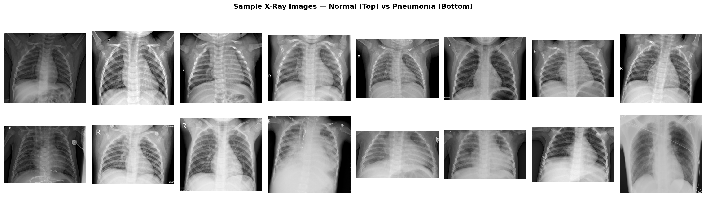
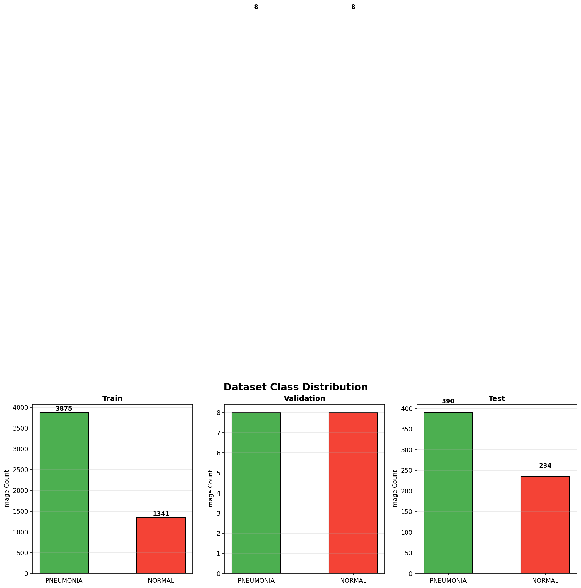
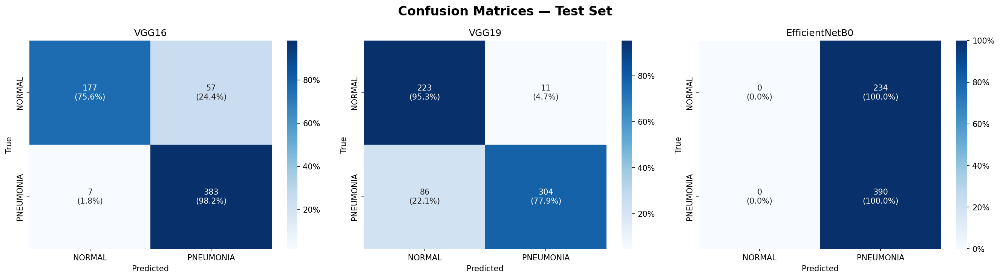
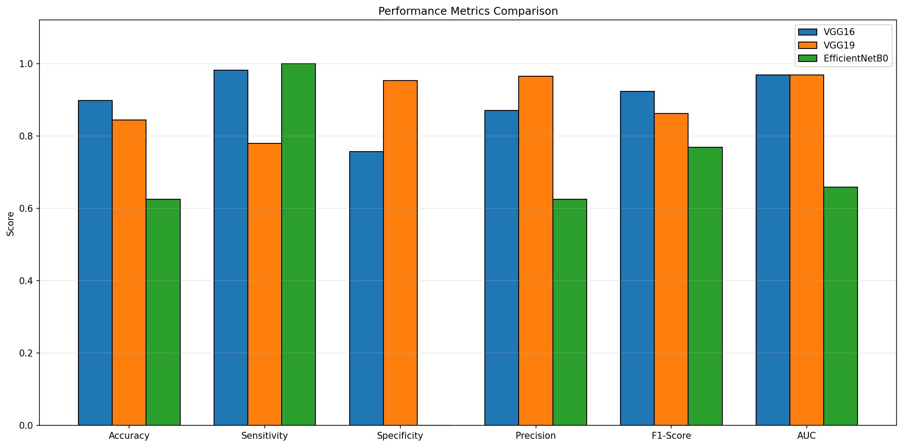
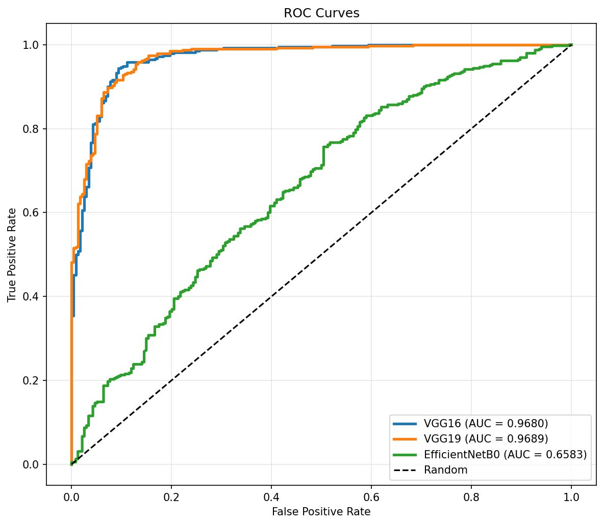
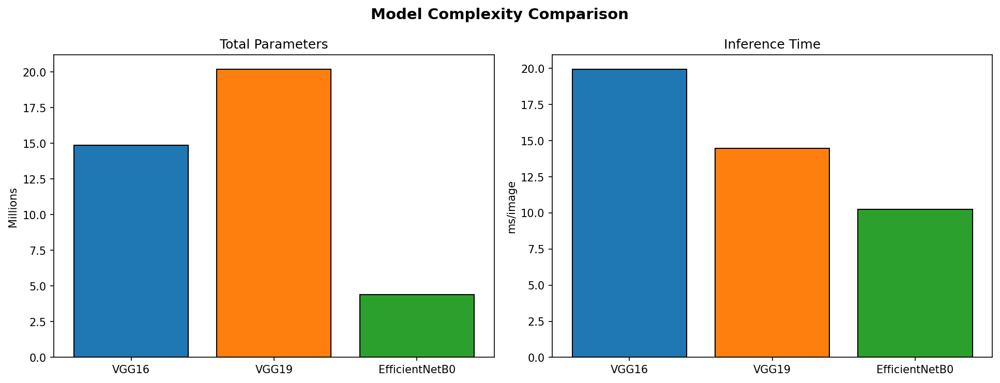
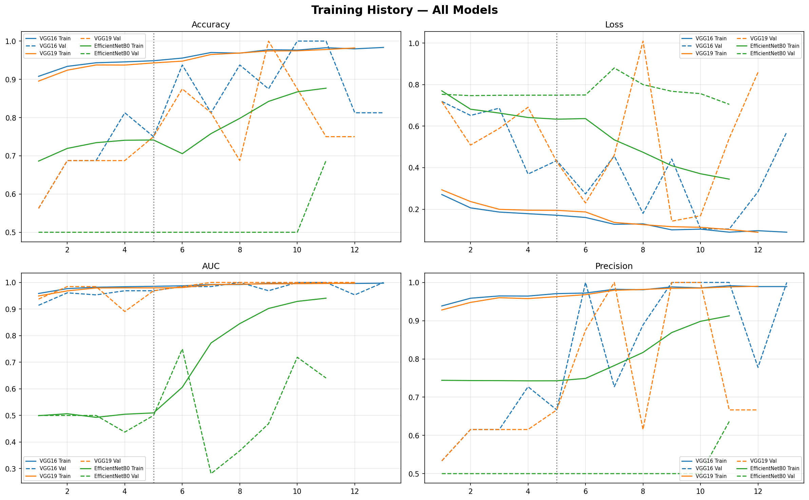
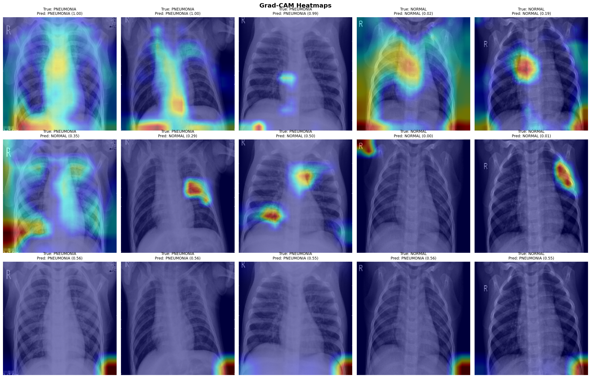

# Chest X-Ray Pneumonia Classification

Professional summary and visual results for the chest X-ray pneumonia classification project.

## Project Overview

This project compares multiple CNN architectures (VGG16, VGG19, EfficientNetB0) for binary classification of chest X-ray images (NORMAL vs PNEUMONIA). The notebook evaluates performance, model complexity, and explainability artifacts to support model selection.

## Figures

All figures below are stored in the `figures/` folder.

### Sample Images

### Dataset Class Distribution

### Confusion Matrices (Test Set)

### Performance Metrics Comparison

### ROC Curves

### Model Complexity

### Training Curves

### Grad-CAM Heatmaps

## Notes

- The `notebook/` directory contains the experiment notebook and reproducible analysis.
- The `csv/` directory includes the summary table of results.
- Figures are intended for quick comparison across models.
